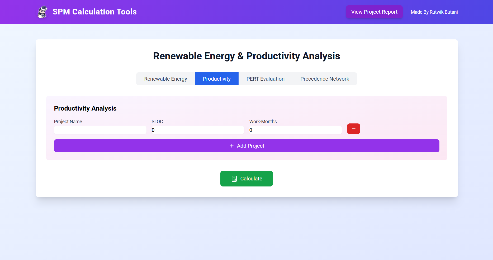
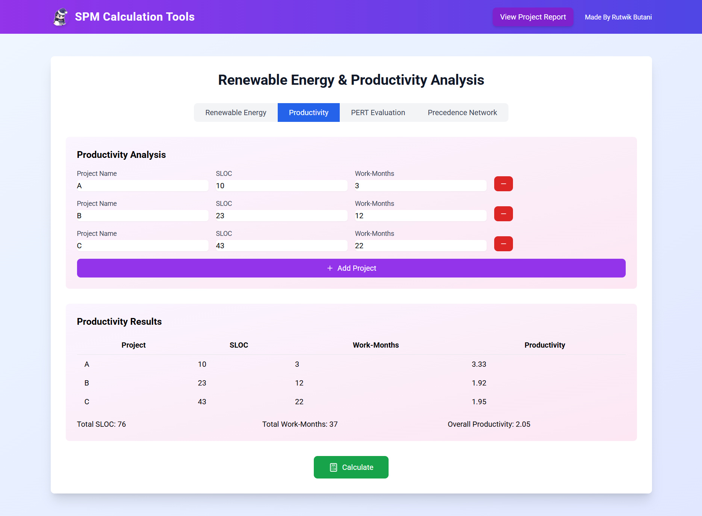
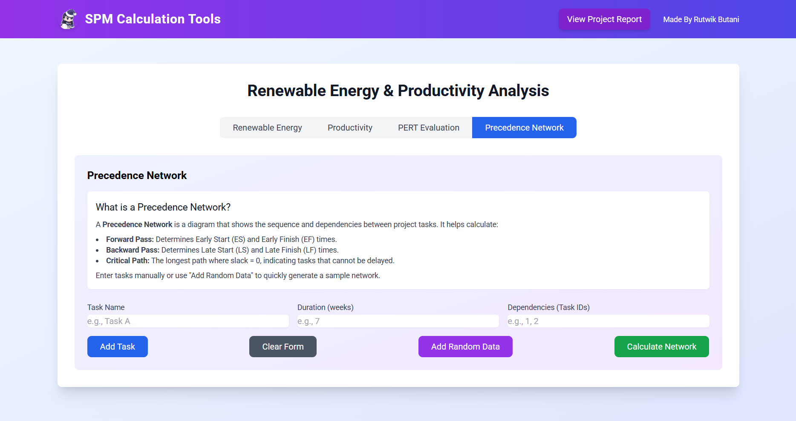
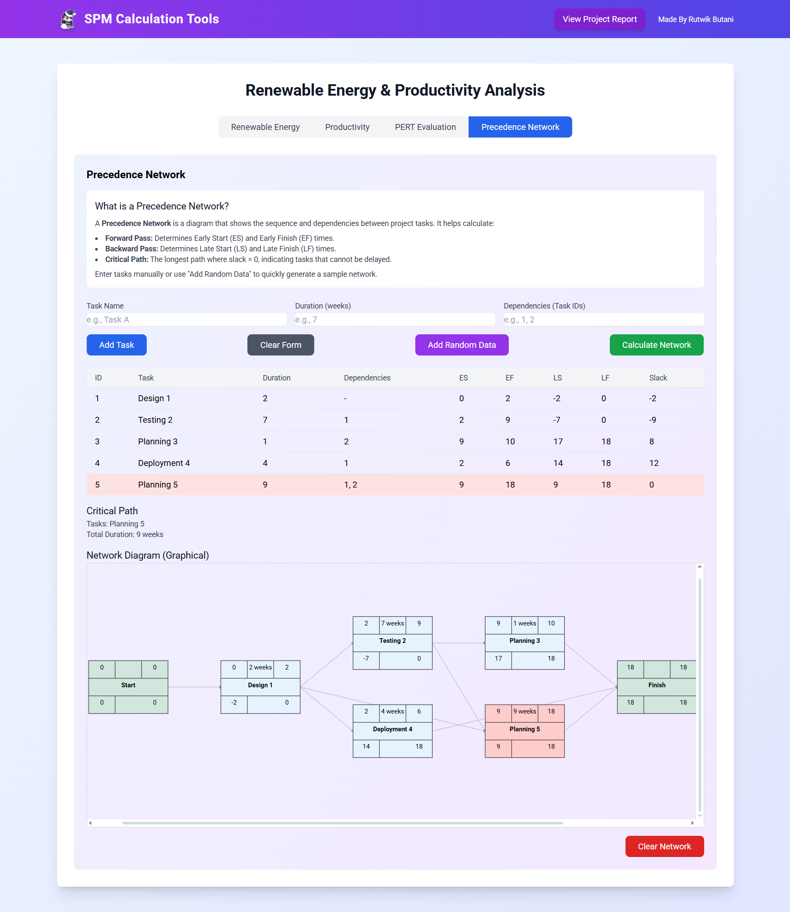

# SPM Analysis Tools


## 🚀 Live Demo

[**Visit the Live Application**](https://spm.rutwikdev.com)

## 📋 Project Overview

SPM Analysis Tools is a comprehensive suite of software project management utilities designed to assist project managers in making informed decisions about project planning, resource allocation, and cost management. The application provides powerful tools for evaluating renewable energy projects, tracking software development productivity, performing PERT analysis, and visualizing project task dependencies.

## ✨ Features

### 🌞 Renewable Energy Project Analysis
- Compare Solar and Wind energy projects based on ROI, NPV, and IRR calculations
- Visualize investment returns over time
- Conduct detailed financial analysis with customizable parameters

### 💻 Software Productivity Analysis
- Track and measure software development productivity across multiple projects
- Compare team performance using key metrics like SLOC per work month
- Identify productivity trends and bottlenecks

### 📊 PERT Analysis
- Calculate task durations using the Program Evaluation and Review Technique
- Determine expected completion times based on optimistic, most likely, and pessimistic estimates
- Calculate variance and standard deviation for better risk assessment

### 🔄 Precedence Network Visualization
- Visualize project task dependencies in a network diagram
- Identify critical paths and dependencies between tasks
- Better understand project structure and workflow

## 🛠️ Technologies Used

### Frontend
- **React** - JavaScript library for building user interfaces
- **TypeScript** - Typed superset of JavaScript for improved developer experience
- **Tailwind CSS** - Utility-first CSS framework for rapid UI development
- **D3.js** - For data visualization components
- **React Hot Toast** - Notification library
- **Lucide React** - Icon library

### Backend (Previously Implemented)
- **Flask** - Python web framework
- **NumPy Financial** - Library for financial calculations

### Deployment
- **Vercel** - Platform for frontend deployment

## 📥 Installation

Follow these steps to set up the project locally:

```bash
# Clone the repository
git clone https://github.com/Rutwik2003/SPM-Analysis-Tools.git

# Navigate to the project directory
cd SPM-Analysis-Tools

# Install dependencies
npm install

# Start the development server
npm run dev
```

## 🚀 Build and Deployment

```bash
# Build the project
npm run build

# Preview the production build locally
npm run preview
```

## 📸 Screenshots

### Renewable Energy Analysis

*Input form for Solar and Wind project analysis*


*Comparative results between Solar and Wind projects*

### Productivity Analysis

*Productivity tracking form with sample project data*


*Productivity metrics across multiple software projects*

### PERT Analysis

*PERT calculator form with sample task estimates*


*Calculated expected times based on PERT analysis*

### Precedence Network

*Input form for creating a Precedence Network*


*Visual representation of task dependencies*

## 🔄 Future Enhancements

- Improved Precedence Network diagram visualization
- PERT critical path visualization
- Integration with project management tools (Jira, Trello)
- Machine learning integration for better project estimations
- Mobile application for on-the-go project management
- Multi-user collaboration features
- Expanded financial analysis metrics
- Customizable dashboard for monitoring multiple projects

## 📝 Project Report

A detailed project report is available directly in the application:
- [View Project Report](https://spm.rutwikdev.com/report)

## 📜 License

This project is licensed under the MIT License - see the [LICENSE](LICENSE) file for details.

## 👨‍💻 Author

**Rutwik Butani**

---

*Made with ❤️ for Software Project Management (SPM) course*
